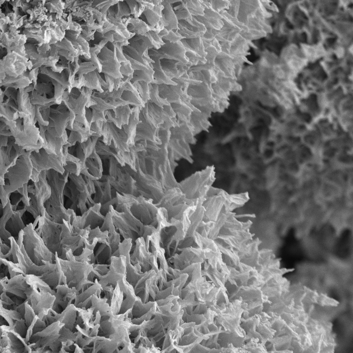

---------------

Our research team is investigating functional materials for sustainability applications

## Photocatalyst Composites

Photocatalysts are materials or molecules that absorb light and use that energy to drive chemical reactions. Our team is exploring
how heterogenous photocatalysts can be improved through modification and incorporation into functional composites. For example, 
by attaching photocatalysts to low-density supports we can make a material that floats in water, is easy to re-use, and concentrates the
photocatalyst at the surface of the water. By incorporating magnetic nanoparticles in a photocatalyst composite, we can collect the
photocatalyst with a strong magnetic field. These changes make our photocatalysts more useful than they are on their own.

   &nbsp;&nbsp;&nbsp;&nbsp;&nbsp;&nbsp;  &nbsp;&nbsp;&nbsp;&nbsp;&nbsp;&nbsp; 

## Solar Photocatalytic Reforming

 Solar reforming (SR) is a sunlight-driven process that enables circular use of waste carbon by transforming it into useful products. This can be done using photocatalysts (or photocatalyst composites) to drive oxidation and reduction reactions. The catalyst can donate excited electrons to make high-energy molecules, then accept replacement electrons from waste, breaking it down in the process. This means we can simultaneously treat wastewater containing organic contaminants and produce CO2-free fuels such as H2.

Right, sunlight is used to power solar photocatalytic reforming using a floating photocatalyst composite, breaking down waste carbon into
organic byproducts and free protons. Those protons are then reduced to form H2 gas.

